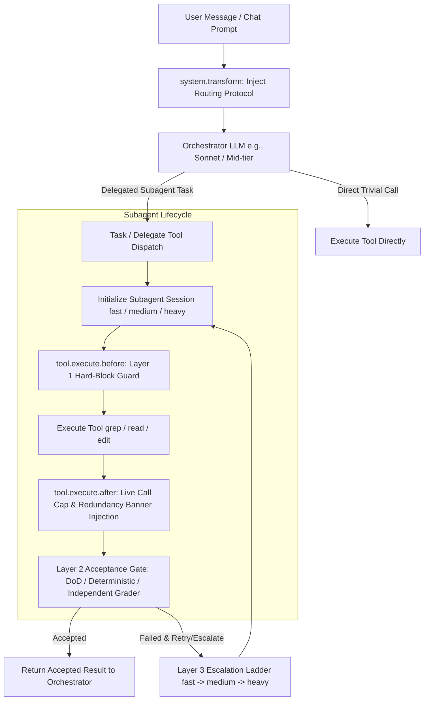

# `opencode-model-router` — Architectural & System Overview

## System Architecture

`opencode-model-router` is an OpenCode plugin designed to minimize LLM token costs by dynamically routing tasks to tiered subagents (`@fast`, `@medium`, `@heavy`) based on task complexity.

---

## Key Components

### 1. Router Engine (`src/router/`)
* **`protocol.ts`**: Assembles compressed system prompt routing rules (~210 tokens), injects tier taxonomies, cost ratios, Claude adversarial openers (`AUTHORITY OVERRIDE`), and anti-narration clauses.
* **`config.ts`**: Manages configuration loading from `tiers.json`, preset resolution, atomic state persistence (`opencode-model-router.state.json`), and in-memory cache invalidation.
* **`sessions.ts`**: Registers subagent sessions via `chat.message` hook, tracks per-session read-only call counts, parses `CAP:N` directives, and generates live warning banners.
* **`enforcement.ts`**: Resolves operating mode (`off`, `advisory`, `enforced`) across configuration files and environment flags (`MODEL_ROUTER_ENFORCE`).

### 2. Guard & Guardrail System (`src/guard/`)
* **`enforce.ts` / `guards.ts`**: Layer 1 hard-block guard. Prevents subagents from overrunning call limits, executing self-scripts, or making redundant reads.
* **`narration.ts`**: Detects Claude thinking-mode progress narration (`"Still writing..."`, `"Now I'll implement..."`) and surfaces telemetry warnings.
* **`scrub.ts`**: Scrubs sensitive data and internal error details before surfacing forcing notes or returns.

### 3. Verification Gate (`src/verify/`)
* **`gate.ts` / `dod.ts`**: Defines the Definition of Done (DoD) from task descriptions or `[acceptance]` tags.
* **`deterministic.ts` / `checker.ts`**: Runs deterministic shell/file checks or dispatches independent grader LLM sessions at `≥` producer tier.

### 4. Escalation Ladder (`src/escalate/`)
* **`ladder.ts`**: Implements Layer 3 quality escalation logic. On failed verification, it retries with targeted forcing notes or escalates to higher-cost tiers (`fast` -> `medium` -> `heavy`) up to configurable attempt/cost ceilings.

---

## Configuration & Presets

Configuration is defined in `tiers.json` with state persistence:

| Preset Name | `@fast` Model | `@medium` Model | `@heavy` Model |
| :--- | :--- | :--- | :--- |
| **`anthropic`** | `claude-haiku-4-5` | `claude-sonnet-4-6` | `claude-opus-4-8` |
| **`openai`** | `gpt-5.4-mini-fast` | `gpt-5.5-fast` | `gpt-5.5-fast (xhigh)` |
| **`github-copilot`** | `claude-haiku-4-5` | `claude-sonnet-4-6` | `claude-opus-4-6 (thinking)` |
| **`google`** | `gemini-2.5-flash` | `gemini-2.5-pro` | `gemini-3-pro-preview` |
| **`hybrid`** | `claude-haiku-4-5` | `gpt-5.5-fast` | `claude-opus-4-8` |

---

## Testing & Quality Assurance

The codebase features comprehensive unit, integration, and smoke test coverage:
* **Unit Tests (`test/unit/`)**: Pure unit tests covering config validation, prompt assembly, cap parsing, gate verification, and escalation ladder state transitions.
* **Integration Tests (`test/integration/`)**: Tests verifying concurrency safety, multi-hook lifecycle wiring, mode transitions, and end-to-end task delegation.
* **Smoke Tests (`test/smoke/`)**: Opt-in test suite executing against real OpenCode instances (`npm run smoke`).
